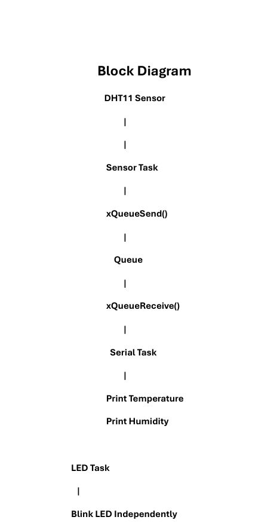
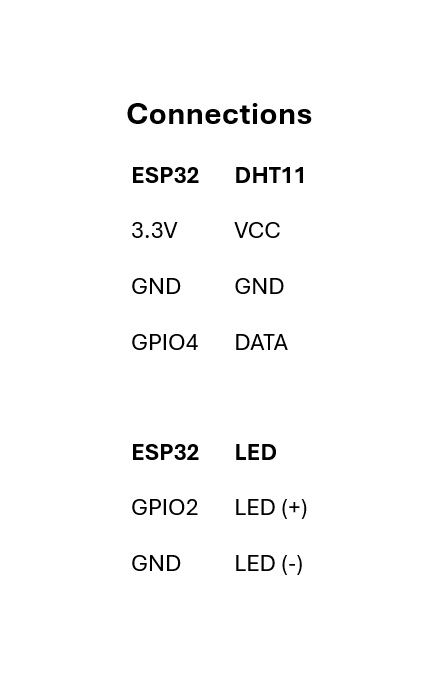
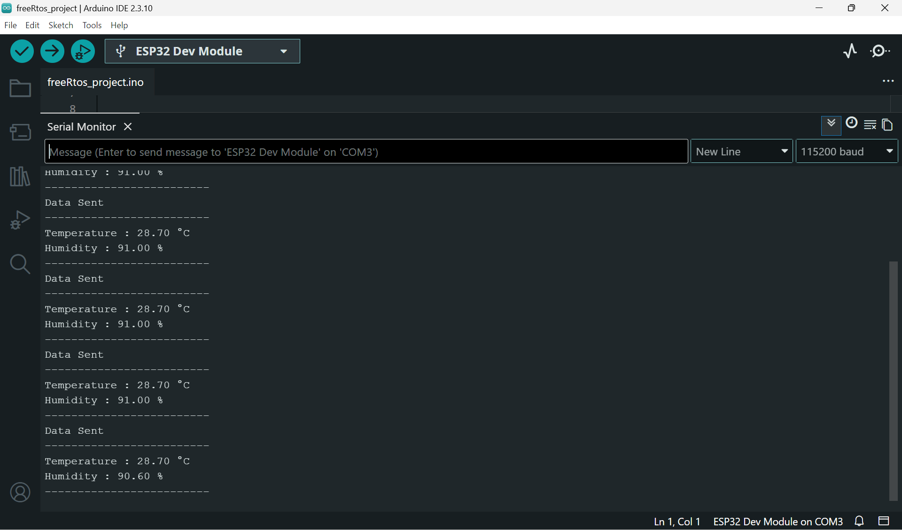

# FreeRTOS-Based-MultiTasking-System

## Overview

This project demonstrates multitasking on the ESP32 using FreeRTOS. It creates separate tasks for LED control, DHT11 sensor reading, and serial communication. A FreeRTOS Queue is used for safe inter-task communication between the sensor task and the serial task.

## Features

- LED blinking using a FreeRTOS task
- DHT11 temperature and humidity reading
- Queue-based inter-task communication
- Serial monitoring of sensor data
- Demonstrates real-time task scheduling

## Hardware Used

- ESP32 DevKit
- DHT11 Sensor
- LED
- Jumper Wires

## Technologies

- ESP32
- FreeRTOS
- Arduino IDE
- DHT11 Sensor

## Project Images

### Block Diagram

### Circuit Diagram

### Serial Monitor Output

## Author

Sajindas M
